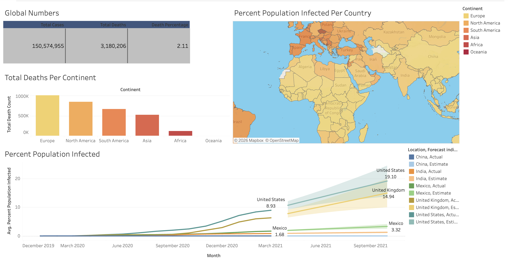

# Global COVID-19 Analysis — SQL + Tableau

Exploring global COVID-19 cases, deaths, and vaccination rollout with **SQL Server**, then turning the results into an interactive **Tableau** dashboard.

**[View the live dashboard on Tableau Public →](https://public.tableau.com/views/GlobalCovidAnalysis_17835447201140/Dashboard1?:language=en-US&:sid=&:redirect=auth&:display_count=n&:origin=viz_share_link)**



---

> **At a glance:** 85K+ rows across two datasets, 210 countries, Jan 2020 – Apr 2021. Data was manually schema-typed and bulk-loaded into SQL Server (running in Docker), explored with 12 analytical queries, saved as a reusable view, and visualized in a four-panel Tableau dashboard. Every insight below is computed directly from the source data.

**Tech:** SQL Server · T-SQL · Docker · Tableau Public · VS Code · Git

**Skills demonstrated:** data modeling & typed schema design · `BULK INSERT` loading · aggregation, joins & `GROUP BY` · CTEs · window functions (running totals) · views · safe division with `NULLIF` · null handling with `COALESCE` · dashboard design & storytelling

---

## Contents

- [The lifecycle](#the-analysis-lifecycle)
- [1. Ask](#1--ask)
- [2. Prepare](#2--prepare)
- [3. Process](#3--process)
- [4. Analyze](#4--analyze)
- [5. Share](#5--share)
- [6. Act](#6--act)
- [Key insights](#key-insights)
- [Limitations](#limitations)
- [Repo structure](#repo-structure)
- [Run it yourself](#run-it-yourself)

---

## The analysis lifecycle

This project is organized around the six stages of a real analytics workflow — **Ask → Prepare → Process → Analyze → Share → Act** — rather than a list of queries. Each stage below maps to actual work in this repo.

---

## 1 · Ask

**Objective:** Analyze global COVID-19 case, death, and vaccination trends to identify which countries and regions were hit hardest, and how vaccination rollout compared to population size.

Business questions driving the analysis:

- Which countries had the **highest infection rate** relative to their population?
- Which countries carried the **highest total death counts**?
- How did the **global death percentage** trend over the pandemic?
- Which **continents** reported the most deaths?
- How did **vaccination rollout** accumulate over time relative to population?

---

## 2 · Prepare

**Source:** [Our World in Data](https://ourworldindata.org/covid-deaths) COVID-19 dataset, split into two files:

| File | Grain | Key fields |
|------|-------|-----------|
| `CovidDeaths.csv` | one row per country per day | `location`, `date`, `population`, `total_cases`, `new_cases`, `total_deaths`, `new_deaths` |
| `CovidVaccinations.csv` | one row per country per day | `location`, `date`, `new_vaccinations`, `total_tests`, plus demographic/health indicators |

**Coverage:** 85,171 rows per file · 210 countries · **1 Jan 2020 – 30 Apr 2021**.

**The key data-quality decision.** The dataset mixes true countries with *aggregate rows* — `World`, `Europe`, `Asia`, and World Bank income groups (e.g. "High income"). These aggregates share the same columns as countries and will silently double-count or distort any ranking. Every analytical query filters on `WHERE continent IS NOT NULL`, which keeps country-level rows and drops the aggregates. This single filter is what makes the rankings trustworthy.

---

## 3 · Process

Loading came with a real obstacle worth documenting.

The SQL Server import wizard **inferred incorrect data types** — reading numeric and date columns as generic text, which broke arithmetic and sorting downstream. Rather than fight the wizard, I:

1. **Wrote explicit `CREATE TABLE` schemas** for both files, typing every column deliberately (`FLOAT` for measures, `DATE` for dates, `NVARCHAR` for text).
2. **Loaded via `BULK INSERT`** with an explicit CSV format spec (`FIELDQUOTE`, `ROWTERMINATOR`, `KEEPNULLS`).

This gave repeatable, controlled loads and correct types from the start — and meant nulls were preserved instead of being coerced to zeros, which matters for honest division later.

```sql
BULK INSERT dbo.CovidDeaths
FROM '/tmp/CovidDeaths.csv'
WITH (FORMAT = 'CSV', FIRSTROW = 2, FIELDQUOTE = '"',
      ROWTERMINATOR = '0x0a', TABLOCK, KEEPNULLS);
```

Row counts and sample rows were then validated (`03_import_check.sql`) before any analysis.

*Scripts: [`01_create_database.sql`](sql/01_create_database.sql) · [`02_load_data.sql`](sql/02_load_data.sql) · [`03_import_check.sql`](sql/03_import_check.sql)*

---

## 4 · Analyze

Twelve queries in [`04_data_exploration.sql`](sql/04_data_exploration.sql) build from simple lookups to a running-total window function. Highlights:

**Safe division — never divide by zero.** Case fatality and infection rates guard every denominator:

```sql
ROUND((total_deaths / NULLIF(total_cases, 0)) * 100, 2) AS case_fatality_rate_pct
```

**Rolling vaccination count — a window function.** A running total of daily vaccinations per country, then expressed as a share of population. `COALESCE` treats missing daily figures as zero so the cumulative sum doesn't break on gaps:

```sql
SUM(COALESCE(v.new_vaccinations, 0)) OVER (
    PARTITION BY d.location
    ORDER BY d.date
) AS rolling_vaccination_count
```

This rolling calculation is saved as a **view**, `dbo.PercentPopulationVaccinated` ([`05_create_views.sql`](sql/05_create_views.sql)), so the dashboard layer can query clean, analysis-ready output without repeating the logic.

**Techniques used:** aggregations · joins · `GROUP BY` · CTEs · window functions · views · `NULLIF` · `COALESCE`.

---

## 5 · Share

The [interactive Tableau dashboard](https://public.tableau.com/views/GlobalCovidAnalysis_17835447201140/Dashboard1?:language=en-US&:sid=&:redirect=auth&:display_count=n&:origin=viz_share_link) is built to answer the questions from stage 1, not just to display charts:

| Panel | Question it answers |
|-------|--------------------|
| **Global KPI banner** | What's the overall toll? *(total cases, total deaths, death %)* |
| **Percent population infected over time** | How fast did infection spread across countries? |
| **Total deaths per continent** | Which regions were hit hardest? |
| **World map — % population infected** | Where were the geographic hotspots? |

---

## 6 · Act

Where this analysis points next — the recommendations an analyst would hand off:

- **Prioritize countries with high infection burden but slow vaccination rollout** by joining the infection-rate ranking against the `PercentPopulationVaccinated` view.
- **Test whether faster vaccination correlated with a falling death percentage** over time, per country.
- **Layer in the health/economic indicators already present** in `CovidVaccinations.csv` — `hospital_beds_per_thousand`, `median_age`, `gdp_per_capita` — to help explain *why* outcomes differed between countries.
- **Build a wave-by-wave time comparison** to see how different countries fared across major COVID waves.

---

## Key insights

*All figures computed from the source data (country-level rows only, through 30 Apr 2021).*

- **The US led the world in total reported deaths — ~576,000**, ahead of Brazil (~404K) and Mexico (~217K). It was also the single largest contributor to North America's toll.
- **Highest death count and highest infection *rate* are two different stories.** The steepest infection rates relative to population were small European states — **Andorra (17.1%)**, Montenegro (15.5%), and Czechia (15.2%) — not the countries with the largest absolute numbers.
- **Europe reported the most deaths of any continent (~1.02M)**, followed by North America (~848K) and South America (~672K).
- **The global reported case fatality rate was ~2.1%** — roughly 3.18M deaths against 150.6M reported cases.
- **The US had ~9.8% of its population reported infected** with a case fatality rate near 1.8%.
- **Removing aggregate rows was essential** — without the `continent IS NOT NULL` filter, "World" and income-group rows would have topped every ranking and made the analysis meaningless.

---

## Limitations

Being explicit about what this data can and can't say:

- **Reported cases ≠ true infections.** Testing availability and reporting standards varied enormously between countries, so cross-country comparisons carry real uncertainty.
- **Vaccination counts are doses, not people.** `new_vaccinations` doesn't distinguish first vs. second doses, so "percent population vaccinated" overstates unique coverage.
- **Continent death totals use `SUM(new_deaths)`**, which depends on consistent daily reporting; late or revised reporting isn't captured.
- **The window closes 30 Apr 2021** — this is an early-to-mid-pandemic snapshot, not the full arc of COVID-19.
- **Aggregate rows exist in the raw data** and must be filtered deliberately; they are not errors, but they are not countries either.

---

## Repo structure

```
global-covid-sql-analysis/
├── data/
│   ├── CovidDeaths.csv
│   └── CovidVaccinations.csv
├── sql/
│   ├── 01_create_database.sql     # create database
│   ├── 02_load_data.sql           # typed schemas + BULK INSERT
│   ├── 03_import_check.sql        # row-count + sample validation
│   ├── 04_data_exploration.sql    # 12 analytical queries
│   └── 05_create_views.sql        # reusable vaccination view
├── images/
│   └── global_covid_dashboard.png
└── README.md
```

---

## Run it yourself

**Requirements:** SQL Server (or the [Docker image](https://hub.docker.com/_/microsoft-mssql-server)), a SQL client (VS Code + MSSQL extension, Azure Data Studio, or SSMS).

1. **Start SQL Server** and copy both CSVs into the container path the load script expects (`/tmp/`).
2. **Run the scripts in order** — `01` → `02` → `03` → `04` → `05`.
3. **Explore** the dashboard on [Tableau Public](https://public.tableau.com/views/GlobalCovidAnalysis_17835447201140/Dashboard1?:language=en-US&:sid=&:redirect=auth&:display_count=n&:origin=viz_share_link), or connect Tableau to the `PercentPopulationVaccinated` view to rebuild it.

---

*Data: [Our World in Data](https://ourworldindata.org/covid-deaths). Built as a portfolio project to demonstrate an end-to-end SQL analytics workflow.*